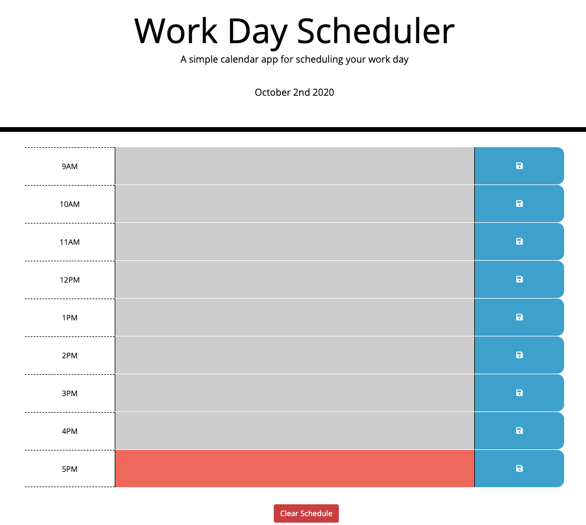
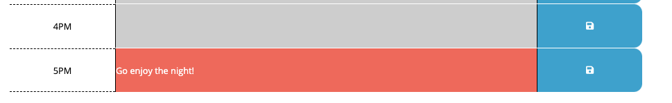

## Work Day Scheduler

This is a simple calendar application that allows the user to save events for each hour of the day. 
This app will run in the browser and feature dynamically updated HTML and CSS powered by jQuery.

# Tech Used

- HTML
- CSS
- JavaScript
- Moment.js 
- jQuery
- Bootstrap

## Deployment

https://noriyuki-ishii-820.github.io/dayPlanner/

## Screenshot

Screenshot 1) UI provides today's date and the text inputs between 8am and 5pm. Past hours are colored grey, current in red and future in green.

Screenshot 2) User can write his/her plans in each hour. Texts are saved in the local storage. The red button on the bottom would erase all inputs. 

## License

MIT

## Contact
Email me: nishii.dev.syd@gmail.com

